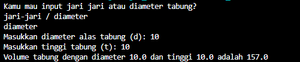
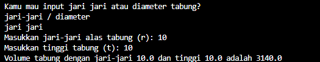

# Soal2SedangNo2
Sebelumnya, kita liat dulu deskripsi soalnya.

Buatlah program menghitung volume tabung dengan menggunakan konsep fungsi.
Sertakan parameter dalam fungsi tersebut

Saya langsung teringat dua hal. Langsung dalam satu file dan dua file. Kesimpulannya:
1. membuat 3 file (solo dan duo).
2. Method.
3. call the method.

So, ezpz. I make two different way for compute the _volume tabung_. Using diameter and _jari-jari_.

This is how:
1. i make the duo file first. one static method and one main.
2. Haha
package Sekolah.UKL;

public class sibau {

    public static double hitungVolumeJariJari(double r, double t) {
        double volume = 3.14 * r * r * t; 
        return volume;
      }
        static double hitungVolumeDiameter(double d, double t) {
        double volume = 3.14 * d * t; 
        return volume;
      }
}
3. ez
double volume = sibau.hitungVolumeDiameter(r, t);
double volume = sibau.hitungVolumeJariJari(r, t);

Just like that, for the **MAIN** quest. And, because i want to make it funny, i add some joke. Just check it out.

Oh yes, i will give you the screenshot of output programs.

